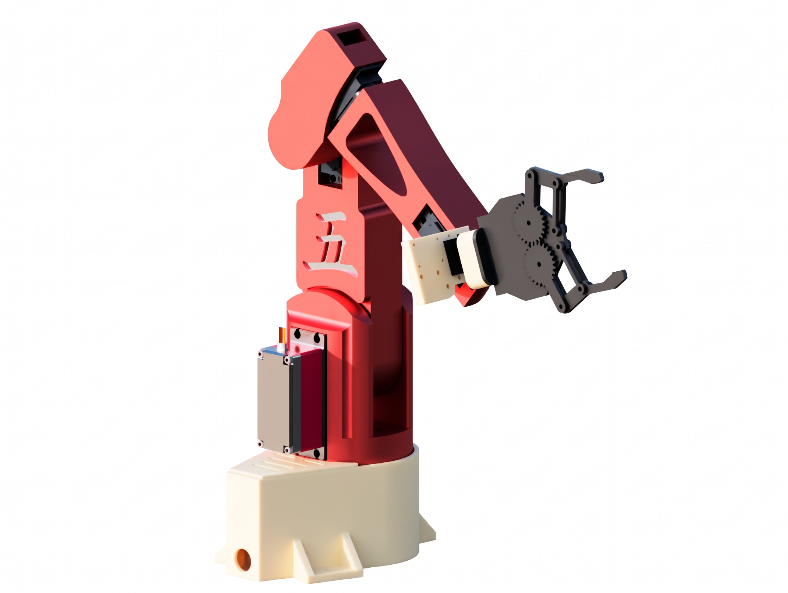

# Project MIRA

**Multimodal Intelligent Robotic Arm**

Voice-controlled 6-DOF arm that can see stuff on the table, grab it, point at it, wave, and talk back. Built by **Team 5 Engineering** at Boston University for the 2026 SILab Dean’s Imagineering Competition.

**Best Freshman** 🏆

Team: David Hytha, Rocco Meausky, Isaac Ryan, Kylor Ghai

---

<p align="center">
  
</p>

---

## What it does

Say **“Hey Mira…”** and she listens, figures out what you want (via an LLM), then actually does it:

| You say | She does |
|--------|----------|
| grab the pig / gumby / otter | HSV track → ToF depth → IK grab |
| point to the pig | same lock-on, but just aims |
| well done / thank you | finds a face and waves |
| show us your moves | full-body joint wiggle |
| yes/no questions | nods or shakes |
| random questions | answers out loud (no motion) |
| thanks for the demo, say bye | judges line + quick wave (no camera search) |

Demo objects we used: pink pig, green gumby, brown otter.

---

## Hardware architecture

Rough layout of what we actually ran in the demo:

```
                    ┌─────────────────┐
                    │   USB Camera    │  (HSV + face)
                    └────────┬────────┘
                             │
  Mic / Speaker ──► Laptop ──┼──► Arduino Uno ──► PCA9685 ──► 7x servos
                             │         ▲
                    ┌────────┴────────┐│
                    │  ToF (VL53L5CX) ││  serial: TRACK / GET_COORDS /
                    │  via RP2040     ││         GRAB / POINT / WAVE /
                    └─────────────────┘│         DEMO / NOD / SHAKE...
                                       │
                              6V servo power supply
                              (separate from logic)
```

Full writeup (BOM, manufacturing, design process) is in [`docs/Project_MIRA.pdf`](docs/Project_MIRA.pdf).

---

## Software pipeline

```
 Mic
  │
  ▼
 Whisper (STT)  ──►  "hey mira, grab the pig"
  │
  ▼
 Groq / Llama   ──►  JSON { spoken_response, robot_action }
  │
  ├─ TTS (edge-tts / Sonia) ──► speaker
  │
  └─ robot_action
        │
        ├─ search_and_pick / point_to
        │     └─ vision_hsv_grab.py
        │           camera HSV lock → ToF depth → GET_COORDS → GRAB/POINT
        │
        ├─ wave          → face search + WAVE
        ├─ show_moves    → DEMO on Arduino
        ├─ gesture       → NOD / SHAKE
        └─ bye / thanks  → WAVE (no vision)
```

### Repo layout

```
robot-arm-ai/
├── firmware/          Arduino sketch (servos, IK, gestures)
├── python/            voice + vision + orchestration
├── docs/              Project MIRA PDF + notes
├── media/             photos
├── scripts/           launchers
├── requirements.txt
└── README.md
```

---

## Quick start (Windows laptop demo)

1. Flash `firmware/search_test_withsweep.ino` to the Arduino (Servo + Adafruit PWM Servo Driver libs).
2. Plug in Arduino + ToF + camera.
3. Set your Groq key (don’t commit the key):
   ```
   set GROQ_API_KEY=gsk_...
   ```
   or drop a one-line `python/groq_api_key.txt` (gitignored).
4. Install deps:
   ```
   pip install -r requirements.txt
   ```
5. Run:
   ```
   scripts\run_windows.bat
   ```
   or:
   ```
   cd python
   python robot_llm_voice.py
   ```

### Useful env vars

| Var | Default | What |
|-----|---------|------|
| `ROBOT_SERIAL_PORT` | `COM3` | Arduino |
| `ROBOT_TOF_PORT` | `COM7` | ToF bridge |
| `ROBOT_LISTEN_SECONDS` | `8` | how long we record each clip |
| `ROBOT_WHISPER_MODEL` | `base.en` | STT model |
| `ROBOT_SKIP_SERIAL=1` | off | voice+LLM only, no arm |

---

## Voice commands

- `Hey Mira, grab the pig`
- `Hey Mira, point to gumby`
- `Hey Mira, well done` → face + wave
- `Hey Mira, show us your moves`
- `Hey Mira, is the pig pink?` → nod/shake + answer
- `Hey Mira, thanks for your help on the demo, say bye!` → judges line + wave

---

## Notes / gotchas

- Keep the Arduino serial open once and reuse it. Opening serial on Windows resets the board and you sit there for like 7 seconds wondering why nothing’s happening.
- HSV ranges in `vision_hsv_grab.py` are tuned for our lighting + objects. Different room = tweak them.

---

## Credits

Built by **Team 5 Engineering** — David Hytha, Rocco Meausky, Isaac Ryan, Kylor Ghai.

Boston University · SILab Dean’s Imagineering Competition 2026
